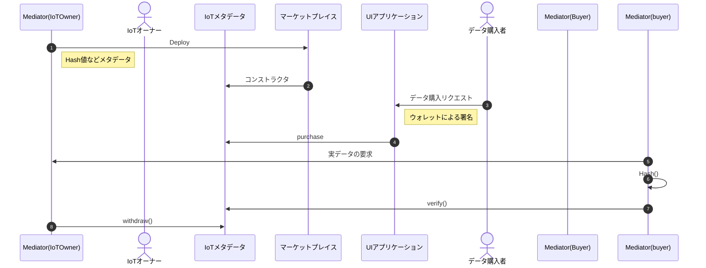

# IoT データマーケットプレイス

ブロックチェーンを用いた IoT データの流通フレームワークです。

# Usage

## Setup

- プロジェクトをクローンする

```bash
git clone https://github.com/ertlnagoya/iot-market.git
cd iot-market
```

- devcontainer の起動  
  VSCode の拡張機能で Remote - Containers をインストールしてください。その後コマンドパレットを開き、devcontainer: Open Folder in Container を選択してください。

- .env ファイルを作成する
  .env.example をコピー・編集して.env ファイルを作成してください。

```bash
cp .env.example .env
```

## コマンド

- コンパイル

```bash
npx hardhat compile
```

- コントラクトの型定義ファイルの生成

```bash
npx hardhat typechain
```

- テスト

```bash
npx hardhat test
```

- ローカルネットワークの起動

```bash
npx hardhat node
```

- デプロイ  
  --network オプションでデプロイ先のネットワークを指定できます。sepolia(テストネット), localhost(ローカルネットワーク), hardhat(コード実行時のみ動作する使い捨てネットワーク) が指定でき、デフォルトは hardhat です。また sepolia を指定した際には etherscan へのコード検証を行います。  
  --tags オプションでデプロイするコントラクト群を指定できます。
  all で全てのコントラクトをデプロイし、それ以外の場合はカンマ区切りで複数のコントラクトを指定できます。デフォルトは all です。
  詳細は deploy フォルダ内のスクリプトを参照してください。

```bash
npx hardhat deploy --tags {tags} --network {network}
```

### シーケンス図


